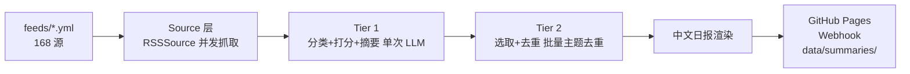

# rss-reader

> 个人信息聚合 + AI 总结系统 — RSS × 三段式 pipeline × 有界 ReAct agent

[](https://www.python.org/)
[](https://github.com/astral-sh/uv)
[](LICENSE)
[](test/)
[](docs/TECH.md)
[](feeds/)

抓取 RSS 源(含自建源 auto-trend、视频源),经两段式 pipeline 产出中文每日简报,发布到 GitHub Pages 与 Webhook。

**特色**:两段式 pipeline(Tier1 分类+打分+摘要 / Tier2 选取+去重)在成本与深度间取得平衡,日 LLM 调用 < 1000 次;每源截断 30 条 + 批量主题去重控制 prompt 与时延;7 大类分类树 + 分类感知阈值保证多样性与重点突出;自建源产出 RSS 即可接入,零适配。

## 快速开始

```bash
uv sync --extra dev
cp .env.example .env  # 填入 OPENAI_API_KEY(必填)
uv run rss-reader --check-config
uv run rss-reader --hours 24
```

## 使用

```bash
# 完整 pipeline(默认)
uv run rss-reader --hours 24

# 分阶段
uv run rss-reader --fetch-only --hours 24
uv run rss-reader --classify-only --hours 24 --limit 10
uv run rss-reader --select-only --hours 24 --limit 15
uv run rss-reader --analyze-one <item_id> --hours 24
uv run rss-reader --hours 24 --no-publish

# 测试(无 mock,真实数据)
uv run pytest
```

## 架构



**两段式 pipeline**:
- **Tier 1**(全量):每源截断 30 条,单次 LLM 分类 + 打分 + 摘要,并发 10
- **Tier 2**(零 AI):URL 去重 + 分类感知阈值 + 批量主题去重(分块并发)+ 配额平衡

## 功能

- 7 大类(ai-research/research/systems/dev-community/tech-news/self-built/video)+ 子类分类树
- 每源截断 30 条控量,批量主题去重(大组分块并发)控制 prompt 大小
- 中文每日简报
- GitHub Pages(Jekyll)+ Webhook(飞书/Slack/Discord/自定义,并发)
- 跨轮去重(SQLite WAL,已处理项跳过)
- tenacity 网络重试(429/5xx/超时)
- 自建源 RSS 接入零适配(auto-trend/FluxSift)
- 财经/加密货币分类预留,启用零代码

## 项目方向

- **全文抽取**:`content_extractor` 字段已定义,未消费
- **Email 发布 / 钉钉 Webhook**

完整 TODO 见 `docs/TODO.md`。

## 文档

| 文档 | 说明 |
|---|---|
| `docs/PRD.md` | 产品需求 |
| `docs/TECH.md` | 技术方案 |
| `docs/API/README.md` | CLI 接口 + 配置 schema + 数据模型 |
| `docs/FLOW/README.md` | 业务流程 + 数据流 |
| `docs/TODO.md` | 不足与未来方向 |

## 贡献

欢迎 issue 与 PR。请先阅读 [CONTRIBUTING.md](CONTRIBUTING.md)。

## License

[MIT](LICENSE)
