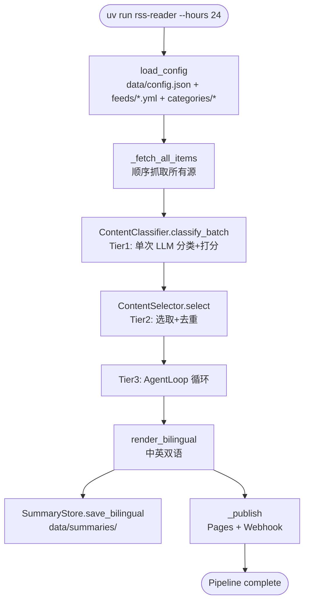
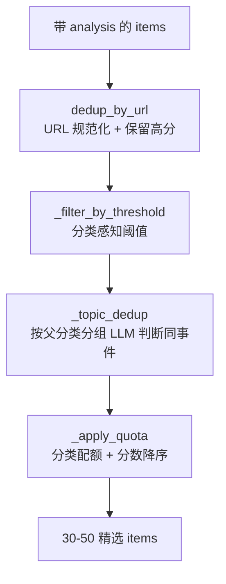
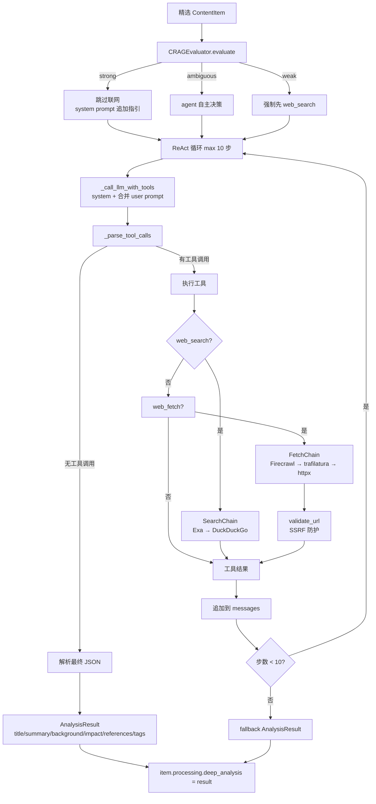
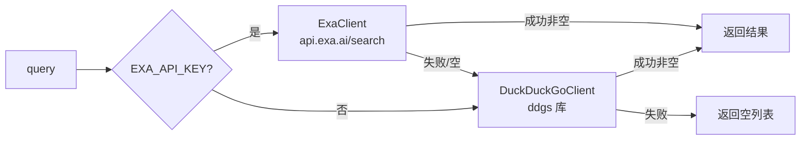
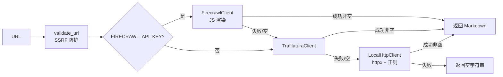
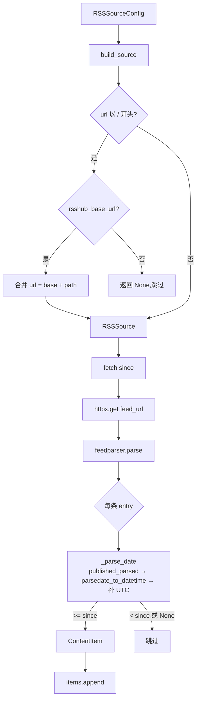

# FLOW

## 完整 pipeline



## Tier 1:分类 + 打分

```mermaid
flowchart LR
    ITEMS[list[ContentItem]<br/>200-500 条] --> BATCH[classify_batch<br/>Semaphore 并发]
    BATCH --> LOOP{每条 item}
    LOOP --> HINT[源级 category hint]
    HINT --> PROMPT[构建 system + user prompt]
    PROMPT --> LLM1[LLM complete<br/>temperature=0.7]
    LLM1 --> PARSE[parse_json_response]
    PARSE -->|失败| RETRY[修复重试<br/>temperature=0]
    RETRY --> PARSE2[parse_json_response]
    PARSE -->|成功| RESULT[ContentAnalysis<br/>category_path + score + summary + tags]
    PARSE2 -->|失败| DEFAULT[默认 analysis<br/>score=0.0]
    RESULT --> SET[item.processing.analysis = result]
    DEFAULT --> SET
    SET --> NEXT{下一条}
    NEXT -->|完成| OUT[带 analysis 的 items]
```

**数据**:输入 `list[ContentItem]`(无 analysis),输出同列表(items 原地修改,`processing.analysis` 填充)。

**并发**:`analysis_concurrency` Semaphore(默认 5),单条失败写入默认 analysis 不中断。

## Tier 2:选取 + 去重



**四步**:
1. `normalize_url` 去 fragment/追踪参数/统一 https/小写 host,同 URL 保留分数最高
2. 每分类独立 threshold(ai-research 7.0 / tech-news 4.0),低于阈值丢弃
3. 按父分类前缀分组(如 `ai-research/ai-vendor` 与 `ai-research/ai-papers` 归 `ai-research`),每组 LLM 判断同事件,保留高分
4. 每分类 `digest_limit` 截取,按分数降序

**数据**:输入 `list[ContentItem]`(带 analysis),输出 30-50 条精选(带 analysis)。

## Tier 3:Agent 循环



**数据**:输入 `ContentItem`(带 analysis),输出 `AnalysisResult`(原地写入 `item.processing.deep_analysis`)。

**工具调用格式**:LLM 在响应中用 ` ```tool\n<name>\n<args>\n``` ` 或 `web_search("query")` 格式声明工具调用。

## 降级链

### SearchChain



### FetchChain



## 双语渲染 + 发布

```mermaid
flowchart LR
    ITEMS[带 analysis + deep_analysis 的 items] --> ZH[render_markdown<br/>lang=zh]
    ITEMS --> EN[render_markdown<br/>lang=en]
    ZH --> BR[BilingualResult<br/>.zh + .en]
    EN --> BR
    BR --> SUM[SummaryStore.save_bilingual<br/>data/summaries/YYYY-MM-DD-{zh,en}.md]
    BR --> PAGES[GitHubPagesPublisher<br/>docs/_posts/YYYY-MM-DD-{zh,en}.md<br/>Jekyll front matter]
    BR --> HOOK{webhook 配置?}
    HOOK -->|是| WH[WebhookPublisher<br/>Feishu/Slack/Discord/Custom]
    HOOK -->|否| SKIP[跳过]
```

## 分类配置加载

```mermaid
flowchart LR
    JSON[data/config.json<br/>categories 段] --> REG[CategoryRegistry.load_from_raw]
    DIR[categories/ 目录] --> FILE{category.json 存在?}
    FILE -->|是| MERGE[merged = raw + category.json]
    FILE -->|否| RAW[merged = raw]
    MERGE --> REG
    RAW --> REG
    REG --> ENABLED[过滤 enabled=True]
    ENABLED --> LIST[list[CategoryConfig]]
```

## Source 抓取


