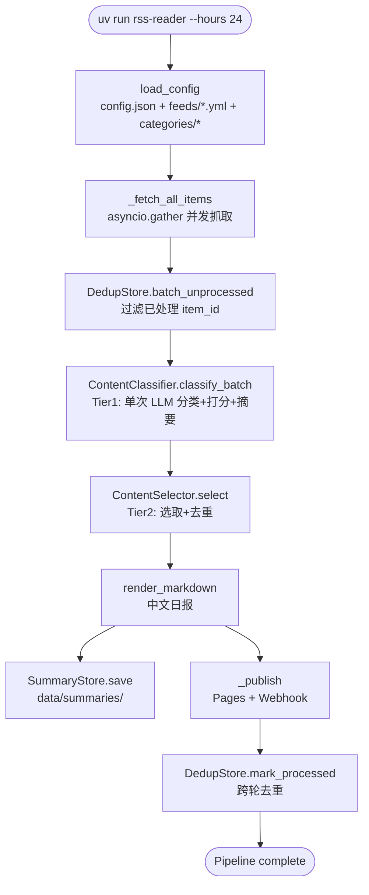
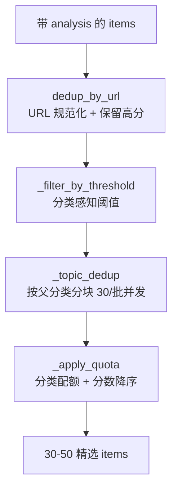
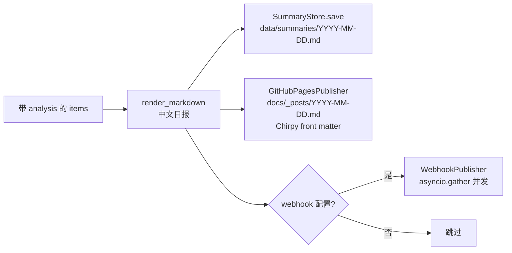
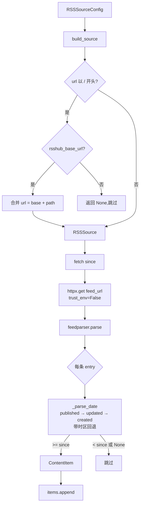

# FLOW

## 完整 pipeline



**数据流**:输入无 → 输出 `data/summaries/YYYY-MM-DD.md` + `docs/_posts/YYYY-MM-DD.md` + webhook 推送 + `dedup.db` 新增 item_id 记录。

## Tier 1:分类 + 打分 + 摘要

```mermaid
flowchart LR
    ITEMS[list[ContentItem]<br/>~500-1000] --> BATCH[classify_batch<br/>Semaphore 并发 10]
    BATCH --> LOOP{每条 item}
    LOOP --> HINT[源级 category hint]
    HINT --> PROMPT[构建 system + user prompt]
    PROMPT --> LLM1[LLM complete<br/>temperature=0.7]
    LLM1 --> PARSE[parse_json_response]
    PARSE -->|失败| RETRY[修复重试<br/>temperature=0]
    RETRY --> PARSE2[parse_json_response]
    PARSE -->|成功| RESULT[ContentAnalysis<br/>category_path + score + summary + tags]
    PARSE2 -->|失败| DEFAULT[默认 analysis<br/>score=0.0]
    RESULT --> SET[item.processing.analysis = result]
    DEFAULT --> SET
    SET --> NEXT{下一条}
    NEXT -->|完成| OUT[带 analysis 的 items]
```

**数据流**:输入 `list[ContentItem]`(无 analysis),输出同列表(items 原地修改,`processing.analysis` 填充)。单条失败写入默认 analysis(score=0.0),不中断。

## Tier 2:选取 + 去重



**数据流**:
1. `normalize_url` 去 fragment/追踪参数/统一 https/小写 host,同 URL 保留分数最高
2. 每分类独立 threshold(ai-research 7.0 / tech-news 4.0),低于阈值丢弃
3. 按父分类前缀分组,大组分块(30/批)`asyncio.gather` 并发,每批一次 LLM 调用判断同事件,保留高分
4. 每分类 `digest_limit` 截取,按分数降序

输入 `list[ContentItem]`(带 analysis),输出 30-50 条精选。

## 中文渲染 + 发布



**数据流**:`render_markdown` 按父分类分节,每条目含 title(链接)/ score / summary / tags。`GitHubPagesPublisher` 写 Chirpy front matter(date 带时区 +0800、categories `[简报]`、tags 从正文 `## 分类` 节提取全小写)。

## 分类配置加载

```mermaid
flowchart LR
    JSON[config.json<br/>categories 段] --> PARSE[parse_category_config]
    DIR[categories/ 目录] --> FILE{category.json 存在?}
    FILE -->|是| MERGE[merged = raw + category.json]
    FILE -->|否| RAW[merged = raw]
    MERGE --> PARSE
    RAW --> PARSE
    PARSE --> ENABLED{enabled?}
    ENABLED -->|是| LIST[list[CategoryConfig]]
    ENABLED -->|否| DROP[丢弃]
```

**数据流**:`parse_category_config`(共享函数)合并 category.json 覆盖 raw,过滤 enabled=False。`config.py._load_category_configs` 与 `CategoryRegistry.load_from_raw` 共享此逻辑,不重复解析。

## Source 抓取



**数据流**:输入 `RSSSourceConfig` + `since: datetime`,输出 `list[ContentItem]`。全量返回(不截断),`DedupStore` 保证每条目恰好处理一次。
