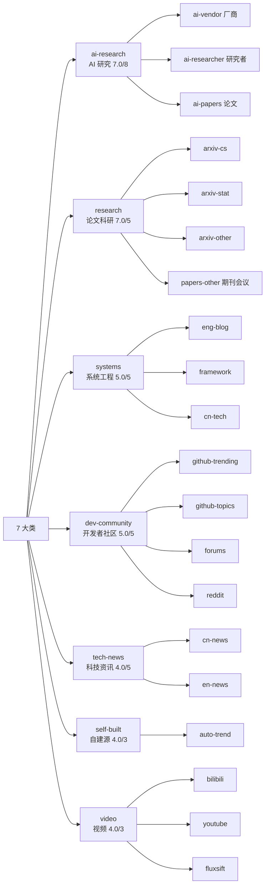

# PRD

## 定位

个人信息聚合 + AI 总结系统。抓取 RSS 源,经两段式 pipeline 产出中文每日简报,发布到 GitHub Pages 与 Webhook。面向单人使用,批处理 cron 形态,无常驻服务。

## 用户故事

- 每日 10 分钟掌握 AI/CS/论文/工程/视频领域动态
- 按分类查看简报,同事件多源合并,论文门槛高于新闻
- 自建源(auto-trend)产出 RSS 即可接入,零适配

## 功能边界

### 已实现

- RSS 聚合:任意 RSS/Atom,`${VAR}` 展开,可选 RSSHub 路由;feed 即消息队列(无时间窗过滤),每源每日消费上限 30 条,断点续传
- 分类体系:7 大类 + 子类,分类感知阈值 + 配额平衡
- Tier 1:单次 LLM 分类 + 打分 + 摘要(合并调用,并发 10)
- Tier 2:URL 去重 + 分类阈值 + 批量主题去重 + 配额平衡(零 AI)
- 中文渲染:产出中文 Markdown 每日简报
- 发布:GitHub Pages(Chirpy 主题)+ Webhook(飞书/Slack/Discord/自定义,并发)
- 落盘:`data/summaries/YYYY-MM-DD.md` + `docs/_posts/YYYY-MM-DD.md`
- 跨轮去重:DedupStore(SQLite,WAL),已处理项跨轮跳过
- 网络重试:tenacity 对 429/5xx/超时指数退避

### 未实现

- 全文抽取(`content_extractor` 字段已定义,未消费)
- Email 发布(SMTP/IMAP)
- 钉钉 Webhook

## 分类树

`finance`/`crypto` 预留(`enabled: false`),启用零代码改动。

## 验收标准

- `uv run rss-reader --check-config` 输出分类树与源数量
- `uv run rss-reader` 完整 pipeline,产出 `data/summaries/` 与 `docs/_posts/`
- `uv run python -m pytest` 全量通过(无 mock,真实数据)
- 日 LLM 调用 < 1000 次
- GitHub Actions daily.yml 跑通,pages-deploy.yml 构建部署 Chirpy 站点
