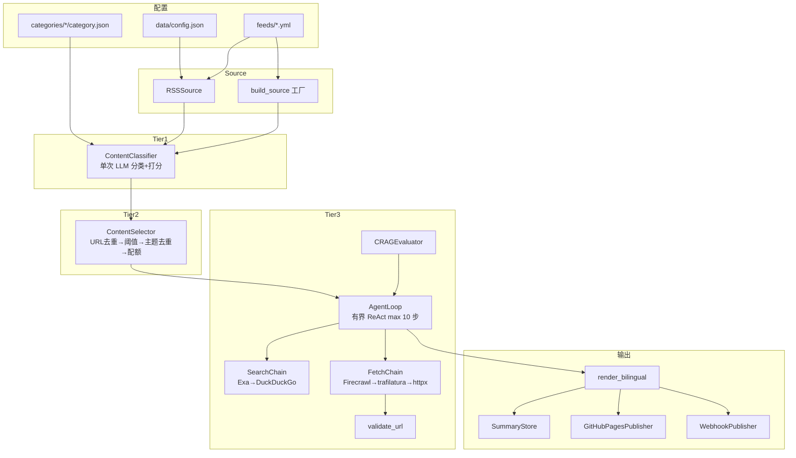
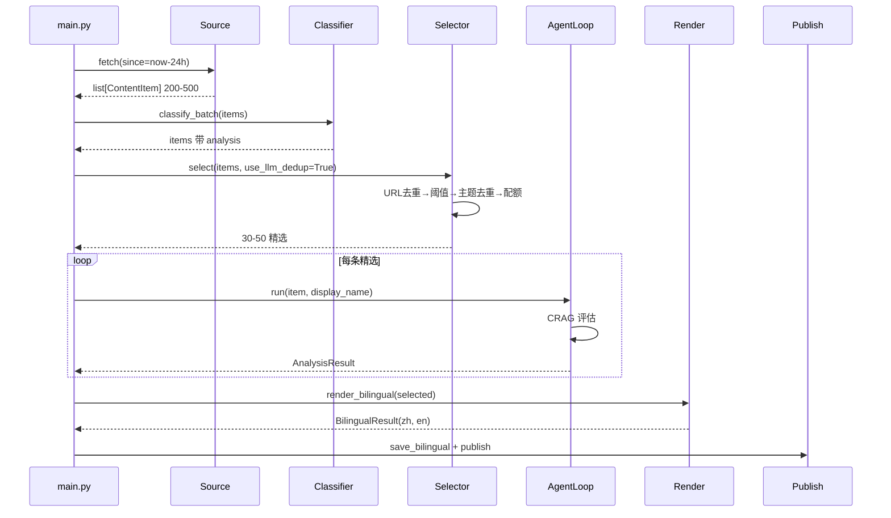

# TECH

## 技术栈

Python 3.12+ · uv · httpx(trust_env=False)· feedparser · pydantic v2 · openai SDK · ddgs · trafilatura · rich · PyYAML · python-dotenv · sqlite3

可选:exa-py(语义搜索)· firecrawl-py(JS 渲染抓取)

## 系统架构



## 模块

### Source 层(`src/sources/`)

```python
class Source(Protocol):
    category: str
    async def fetch(self, since: datetime) -> list[ContentItem]: ...

class RSSSource:
    def __init__(self, config: RSSSourceConfig, http_client: httpx.AsyncClient): ...
    async def fetch(self, since: datetime) -> list[ContentItem]: ...

def build_source(
    config: RSSSourceConfig,
    rsshub_base_url: str | None,
    http_client: httpx.AsyncClient,
) -> RSSSource | None
```

`RSSSource` 用 feedparser 解析,日期解析带时区回退(`published_parsed` → `parsedate_to_datetime` → 补 UTC),`${VAR}` 环境变量展开。`build_source` 工厂函数:URL 以 `/` 开头且配置 `rsshub_base_url` 时合并为 RSSHub 直链,否则返回 `RSSSource` 或 `None`(跳过)。

### 配置加载(`src/config.py`)

```python
class Config:
    ai: dict
    categories: dict          # raw
    category_configs: list[CategoryConfig]  # enabled only
    sources: list[RSSSourceConfig]  # enabled only
    outputs: dict
    rsshub_base_url: str | None
    data_dir: Path

def load_config(project_dir: Path | None) -> Config
```

加载 `data/config.json`(主配置)+ `categories/*/category.json`(分类)+ `feeds/*.yml`(源),支持 `${VAR}` 展开。

### 分类注册表(`src/processing/categories.py`)

```python
class CategoryRegistry:
    def load_from_raw(self, raw_categories: dict) -> None
    def all(self) -> list[CategoryConfig]
    def get(self, name: str) -> CategoryConfig | None
    def get_by_path(self, category_path: str) -> CategoryConfig | None
    def get_analysis_prompt(self, name: str) -> str | None
    def get_agent_prompt(self, name: str) -> str | None
    def category_tree_json(self) -> str
```

按名/路径前缀查询,`get_analysis_prompt`/`get_agent_prompt` 从 `categories/<cat>/*.md` 按需读取。

### AI 客户端(`src/ai/client.py`)

```python
class AIClientConfig:
    provider: str
    model: str
    api_key_env: str
    base_url: str | None
    analysis_concurrency: int
    throttle_sec: float

class AIClient:
    def __init__(self, config: AIClientConfig)
    async def complete(self, system: str, user: str, temperature: float = 0.7, max_tokens: int | None = None) -> str
```

OpenAI 兼容,通过 `api_key_env` + `base_url` + `model` 适配 OpenAI/DeepSeek/Gemini/Ollama 等。

### Tier 1:分类 + 打分(`src/ai/classifier.py`)

```python
class ContentClassifier:
    def __init__(self, ai_client: AIClient, categories: CategoryRegistry, console: Console | None = None)
    async def classify_and_score(self, item: ContentItem) -> None  # 原地修改 item.processing.analysis
    async def classify_batch(self, items: list[ContentItem]) -> list[ContentItem]
```

单次 LLM 调用合并分类与打分,源级 `category` hint 可 override,JSON 修复重试一次(temperature=0)。`classify_batch` 并发控制(`analysis_concurrency` Semaphore),单条失败写入默认 analysis 不中断。

### Tier 2:选取 + 去重(`src/ai/selector.py`)

```python
class ContentSelector:
    def __init__(self, categories: CategoryRegistry, client: AIClient | None = None)
    async def select(self, items: list[ContentItem], use_llm_dedup: bool = True) -> list[ContentItem]
```

四步:`dedup_by_url`(URL 规范化去重)→ `_filter_by_threshold`(分类感知阈值)→ `_topic_dedup`(按父分类分组,LLM 判断同事件)→ `_apply_quota`(分类配额,分数降序截取)。

### Tier 3:Agent 循环(`src/ai/agent/loop.py`)

```python
class AgentLoop:
    def __init__(self, client, registry, crag, search_chain, fetch_chain, max_steps: int = 10)
    async def run(self, item: ContentItem, category_display_name: str) -> AnalysisResult
```

有界 ReAct 循环,CRAG 入口评估(strong 跳过联网 / ambiguous 自主 / weak 强制),工具调用 `web_search` + `web_fetch`,输出结构化 JSON。超步返回 fallback `AnalysisResult`。

### CRAG(`src/ai/agent/crag.py`)

```python
class CRAGEvaluator:
    def evaluate(self, item: ContentItem) -> str  # "strong" | "ambiguous" | "weak"
```

启发式:`<500 字符 → weak`,`>2000 字符 + 技术细节 → strong`,其余 `ambiguous`。

### 降级链(`src/ai/agent/search_chain.py`、`fetch_chain.py`)

```python
class SearchChain:
    backends: list[SearchClient]  # [ExaClient(if key), DuckDuckGoClient(always)]
    async def search(self, query: str, max_results: int = 5) -> list[SearchResult]

class FetchChain:
    backends: list[FetchClient]  # [FirecrawlClient(if key), TrafilaturaClient, LocalHttpClient]
    async def fetch(self, url: str) -> str  # 入口 validate_url
```

首个成功返回,全失败返回空列表/空字符串,末位零配置兜底。

### SSRF 防护(`src/ai/agent/ssrf.py`)

```python
def validate_url(url: str) -> None  # 抛 ValidationError
```

拒绝 localhost / IPv4 私有网段 / 云元数据 / 非 HTTP 协议。

### 渲染(`src/render/`)

```python
def render_markdown(items: list[ContentItem], date: datetime, lang: str = "zh") -> str

def render_bilingual(items: list[ContentItem], date: datetime) -> BilingualResult  # .zh + .en
```

按父分类分节,每条目含 title(链接)/ score / summary / background / impact / references / tags。

### 发布(`src/publish/`)

```python
class GitHubPagesPublisher:
    def __init__(self, posts_dir: Path)
    def publish(self, zh: str, en: str, date: datetime) -> tuple[Path, Path]  # 同步,写 YYYY-MM-DD-{zh,en}.md

class WebhookPublisher:
    def __init__(self, configs: list[dict])
    async def publish(self, content: str, date: datetime) -> list[tuple[bool, str | None]]
```

`GitHubPagesPublisher` 写 Jekyll front matter(layout/title/date/lang)。`WebhookPublisher` 支持 Feishu/Slack/Discord/Custom,单 webhook 失败不中断。

### 存储(`src/storage/`)

```python
class DedupStore:  # SQLite, item_id + fetched_at
    def __init__(self, db_path: Path | str)
    def is_processed(self, item_id: str) -> bool
    def mark_processed(self, item_id: str) -> None
    def batch_unprocessed(self, item_ids: list[str]) -> list[str]

class SummaryStore:  # Markdown 落盘
    def __init__(self, summaries_dir: Path | str)
    def save(self, content: str, date: datetime) -> Path
    def save_bilingual(self, zh: str, en: str, date: datetime) -> tuple[Path, Path]
    def load(self, date: datetime, lang: str | None = None) -> str | None
```

### 工具(`src/utils/url.py`、`src/processing/content.py`、`src/processing/dedup.py`)

```python
def normalize_url(url: str) -> str  # 去 fragment/追踪参数,统一 https,小写 host
def split_content(text: str) -> ContentParts  # main + comments
def select_content(text: str, max_chars: int, sampling: str = "head") -> str
def dedup_by_url(items: list[ContentItem]) -> list[ContentItem]  # 保留高分
def group_by_category(items: list[ContentItem], by_parent: bool = False) -> dict[str, list[ContentItem]]
```

## 数据流



## 存储

| 数据 | 方案 | 路径 |
|---|---|---|
| 每日总结 | Markdown | `data/summaries/YYYY-MM-DD-{zh,en}.md` |
| GitHub Pages | Jekyll | `docs/_posts/YYYY-MM-DD-{zh,en}.md` |
| 去重状态 | SQLite | `data/dedup.db`(已实现,未接入 pipeline) |
| 主配置 | JSON | `data/config.json` |
| 源配置 | YAML | `feeds/*.yml`(6 文件,84 源) |
| 分类配置 | JSON | `categories/*/category.json`(8 分类) |

## 配置

主配置 `data/config.json`:

```jsonc
{
  "ai": {"provider": "openai", "model": "gpt-4o-mini", "api_key_env": "OPENAI_API_KEY", "base_url": null, "analysis_concurrency": 5},
  "rsshub_base_url": null,
  "categories": { /* 8 分类,6 enabled + 2 预留 */ },
  "outputs": {"github_pages": true, "email": {"enabled": false}, "webhook": []}
}
```

源配置 `feeds/*.yml`:

```yaml
- name: Anthropic News
  url: https://www.anthropic.com/news/rss.xml
  category: ai-research/ai-vendor
  enabled: true
  content_extractor: null  # 字段已定义,未消费(见 TODO)
```

## 安全

- SSRF 防护:`validate_url` 拒绝 localhost/内网/云元数据(见 TODO:IPv6/重定向漏洞)
- API key:存 `.env`,`api_key_env` 仅存环境变量名
- `trust_env=False`:所有 httpx 客户端禁用系统代理
- 速率:`analysis_concurrency` Semaphore + `throttle_sec`(已定义,未消费 — 见 TODO)
