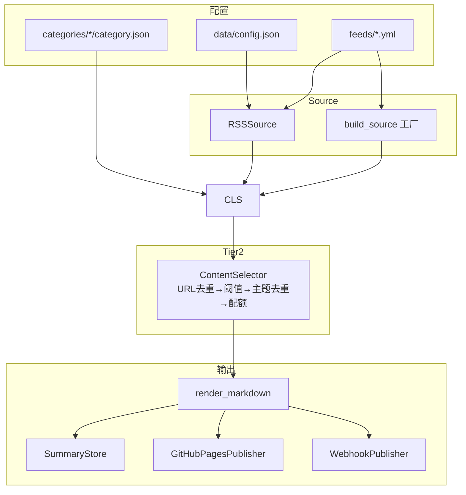
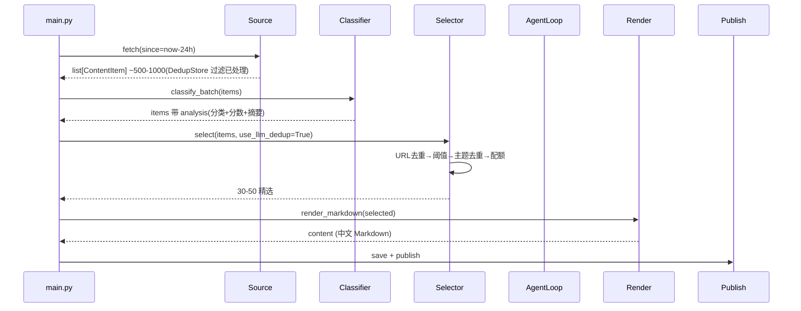

# TECH

## 技术栈

Python 3.12+ · uv · httpx(trust_env=False)· feedparser · pydantic v2 · openai SDK · tenacity · rich · PyYAML · python-dotenv · sqlite3

前端:Jekyll + Chirpy 主题(GitHub Actions 构建)

## 系统架构



## 模块

### Source 层(`src/sources/`)

```python
class Source(Protocol):
    category: str
    async def fetch(self, since: datetime) -> list[ContentItem]: ...

class RSSSource:
    def __init__(self, config: RSSSourceConfig, http_client: httpx.AsyncClient): ...
    async def fetch(self, since: datetime) -> list[ContentItem]: ...

def build_source(
    config: RSSSourceConfig,
    rsshub_base_url: str | None,
    http_client: httpx.AsyncClient,
) -> RSSSource | None
```

`RSSSource` 用 feedparser 解析,日期解析带时区回退(`published_parsed` → `parsedate_to_datetime` → 补 UTC),`${VAR}` 环境变量展开。`build_source` 工厂函数:URL 以 `/` 开头且配置 `rsshub_base_url` 时合并为 RSSHub 直链,否则返回 `RSSSource` 或 `None`(跳过)。

### 配置加载(`src/config.py`)

```python
class Config:
    ai: dict
    categories: dict          # raw
    category_configs: list[CategoryConfig]  # enabled only
    sources: list[RSSSourceConfig]  # enabled only
    outputs: dict
    rsshub_base_url: str | None
    data_dir: Path

def load_config(project_dir: Path | None = None, config_path: str | None = None) -> Config
```

加载 `data/config.json`(主配置,`config_path` 覆盖默认路径)+ `categories/*/category.json`(分类)+ `feeds/*.yml`(源),支持 `${VAR}` 展开(`utils/env.py` 共享)。

### 分类注册表(`src/processing/categories.py`)

```python
class CategoryRegistry:
    def load_from_raw(self, raw_categories: dict) -> None
    def all(self) -> list[CategoryConfig]
    def get(self, name: str) -> CategoryConfig | None
    def get_by_path(self, category_path: str) -> CategoryConfig | None
    def get_analysis_prompt(self, name: str) -> str | None
    def get_agent_prompt(self, name: str) -> str | None
    def category_tree_json(self) -> str
```

按名/路径前缀查询,`get_analysis_prompt`/`get_agent_prompt` 从 `categories/<cat>/*.md` 按需读取。

### AI 客户端(`src/ai/client.py`)

```python
class AIClientConfig:
    provider: str
    model: str
    api_key_env: str
    base_url: str | None
    analysis_concurrency: int

class AIClient:
    def __init__(self, config: AIClientConfig)
    async def complete(self, system: str | None = None, user: str | None = None, *, messages: list[dict] | None = None, temperature: float = 0.7, max_tokens: int | None = None) -> str
```

OpenAI 兼容,通过 `api_key_env` + `base_url` + `model` 适配 OpenAI/DeepSeek/Gemini/Ollama 等。`complete` 支持单轮(`system`+`user`,Tier1/Tier2)与多轮(`messages` 列表,Tier3 ReAct)。`AsyncOpenAI` 设 `timeout=60s`。

### Tier 1:分类 + 打分(`src/ai/classifier.py`)

```python
class ContentClassifier:
    def __init__(self, ai_client: AIClient, categories: CategoryRegistry, console: Console | None = None)
    async def classify_and_score(self, item: ContentItem) -> None  # 原地修改 item.processing.analysis
    async def classify_batch(self, items: list[ContentItem]) -> list[ContentItem]
```

单次 LLM 调用合并分类与打分,源级 `category` hint 可 override,JSON 修复重试一次(temperature=0)。`classify_batch` 并发控制(`analysis_concurrency` Semaphore),单条失败写入默认 analysis 不中断。

### Tier 2:选取 + 去重(`src/ai/selector.py`)

```python
class ContentSelector:
    def __init__(self, categories: CategoryRegistry, client: AIClient | None = None)
    async def select(self, items: list[ContentItem], use_llm_dedup: bool = True) -> list[ContentItem]
```

四步:`dedup_by_url`(URL 规范化去重)→ `_filter_by_threshold`(分类感知阈值)→ `_topic_dedup`(按父分类分组,LLM 判断同事件)→ `_apply_quota`(分类配额,分数降序截取)。

### 渲染(`src/render/`)

```python
def render_markdown(items: list[ContentItem], date: datetime) -> str
```

按父分类分节,每条目含 title(链接)/ score / summary / tags。title/url 转义 Markdown 特殊字符(`]`、`)`)。

### 发布(`src/publish/`)

```python
class GitHubPagesPublisher:
    def __init__(self, posts_dir: Path)
    def publish(self, content: str, date: datetime) -> Path  # 写 YYYY-MM-DD.md

class WebhookPublisher:
    def __init__(self, configs: list[dict])
    async def publish(self, content: str, date: datetime) -> list[tuple[bool, str | None]]  # 并发
```

`GitHubPagesPublisher` 写 Jekyll front matter(layout/title/date)。`WebhookPublisher` 支持 Feishu/Slack/Discord/Custom,`asyncio.gather` 并发,单 webhook 失败不中断。

### 存储(`src/storage/`)

```python
class DedupStore:  # SQLite, item_id + fetched_at,接入 pipeline
    def __init__(self, db_path: Path | str)  # WAL + check_same_thread=False
    def is_processed(self, item_id: str) -> bool
    def mark_processed(self, item_id: str) -> None
    def batch_unprocessed(self, item_ids: list[str]) -> list[str]

class SummaryStore:  # Markdown 落盘
    def __init__(self, summaries_dir: Path | str)
    def save(self, content: str, date: datetime) -> Path
    def load(self, date: datetime) -> str | None
```

### 工具(`src/utils/url.py`、`src/processing/content.py`、`src/processing/dedup.py`)

```python
def normalize_url(url: str) -> str  # 去 fragment/追踪参数,统一 https,小写 host
def split_content(text: str) -> ContentParts  # main + comments
def select_content(text: str, max_chars: int, sampling: str = "head") -> str
def dedup_by_url(items: list[ContentItem]) -> list[ContentItem]  # 保留高分
def group_by_category(items: list[ContentItem], by_parent: bool = False) -> dict[str, list[ContentItem]]
```

## 数据流



## 存储

| 数据 | 方案 | 路径 |
|---|---|---|
| 每日总结 | Markdown | `data/summaries/YYYY-MM-DD.md` |
| GitHub Pages | Jekyll | `docs/_posts/YYYY-MM-DD.md` |
| 去重状态 | SQLite | `data/dedup.db`(WAL,接入 pipeline) |
| 主配置 | JSON | `data/config.json` |
| 源配置 | YAML | `feeds/*.yml`(6 文件,84 源) |
| 分类配置 | JSON | `categories/*/category.json`(8 分类) |

## 配置

主配置 `data/config.json`:

```jsonc
{
  "ai": {"provider": "openai", "model": "gpt-4o-mini", "api_key_env": "OPENAI_API_KEY", "base_url": null, "analysis_concurrency": 5},
  "rsshub_base_url": null,
  "categories": { /* 8 分类,6 enabled + 2 预留 */ },
  "outputs": {"github_pages": true, "email": {"enabled": false}, "webhook": []}
}
```

源配置 `feeds/*.yml`:

```yaml
- name: Anthropic News
  url: https://www.anthropic.com/news/rss.xml
  category: ai-research/ai-vendor
  enabled: true
  content_extractor: null  # 字段已定义,未消费(见 TODO)
```

## 安全

- API key:存 `.env`,`api_key_env` 仅存环境变量名
- `trust_env=False`:所有 httpx 客户端禁用系统代理(CI 友好;本地需代理的国际源会抓取失败,日志 WARNING)
- 速率:`analysis_concurrency=10` Semaphore;`tenacity` 对 429/5xx/超时指数退避(3 次)
- 跨轮去重:`DedupStore` 过滤已处理 `item_id`,每条目恰好 Tier1 一次(冷启动处理历史,稳态仅处理新增),无丢弃无重处理
