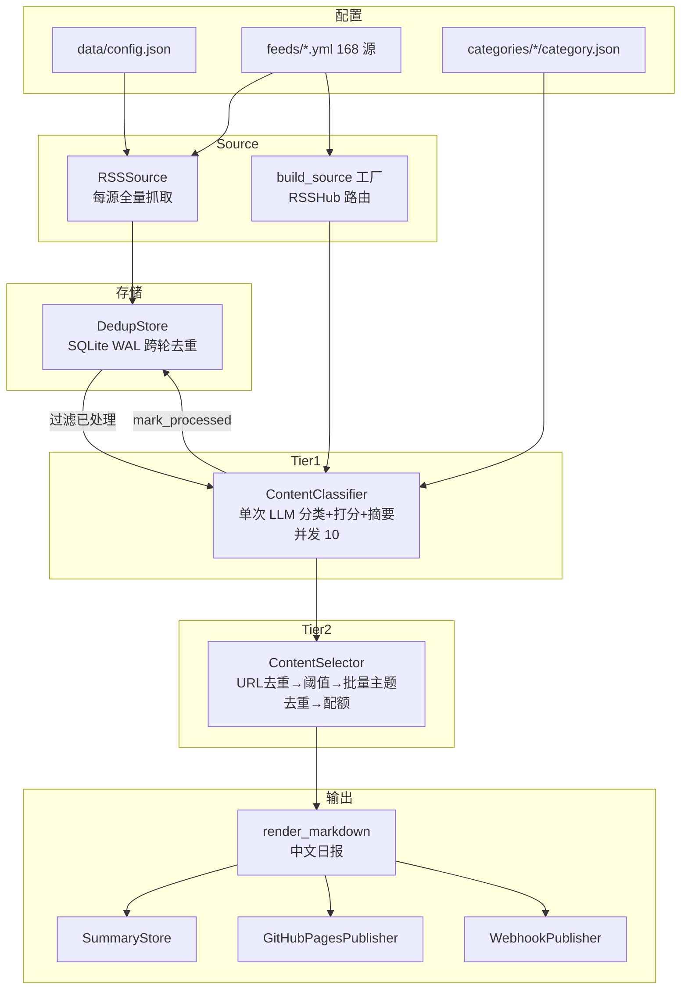
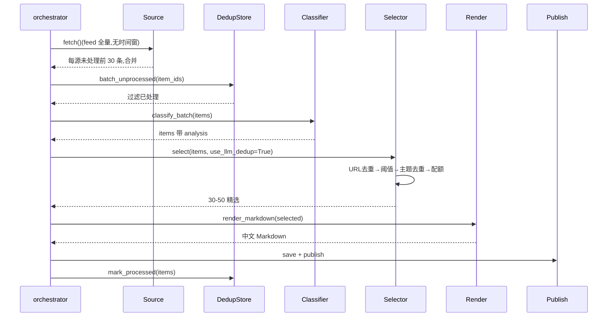

# TECH

## 技术栈

Python 3.12+ · uv · httpx · feedparser · pydantic v2 · openai SDK · tenacity · rich · PyYAML · python-dotenv · sqlite3

前端:Jekyll + Chirpy 主题(GitHub Actions 构建)

LLM:OpenAI 兼容端点(本项目用 GLM via 火山方舟,与 Claude Code 同凭证机制:`.env` 配 `OPENAI_API_KEY`/`OPENAI_BASE_URL`/`OPENAI_MODEL`)

## 系统架构



## 模块

### Source 层(`src/sources/`)

```python
class Source(Protocol):
    category: str
    async def fetch(self) -> list[ContentItem]: ...  # feed 全量(队列)

class RSSSource:
    def __init__(self, config: RSSSourceConfig, http_client: httpx.AsyncClient): ...
    async def fetch(self) -> list[ContentItem]: ...  # feed 全量,无时间窗过滤

def build_source(config, rsshub_base_url, http_client) -> RSSSource | None
```

`RSSSource` 用 feedparser 解析,日期带时区回退,`${VAR}` 展开。`build_source`:`/` 开头 URL 合并 RSSHub base,无 base 返回 None(跳过)。

### 配置加载(`src/config.py`)

```python
class Config:
    ai: dict
    categories: dict          # raw
    category_configs: list[CategoryConfig]  # enabled only
    sources: list[RSSSourceConfig]  # enabled only
    outputs: dict
    rsshub_base_url: str | None
    data_dir: Path

def load_config(project_dir: Path | None = None, config_path: str | None = None) -> Config
```

加载 `data/config.json` + `categories/*/category.json` + `feeds/*.yml`,支持 `${VAR}` 展开(`utils/env.py` 共享)。

### AI 客户端(`src/ai/client.py`)

```python
class AIClient:
    def __init__(self, config: AIClientConfig)  # AsyncOpenAI, timeout=60s
    async def complete(self, system: str, user: str, *, temperature=0.7, max_tokens=None) -> str
```

OpenAI 兼容,`tenacity` 重试 429/5xx/超时(3 次指数退避,4xx 不重试)。

### Tier 1(`src/ai/classifier.py`)

```python
class ContentClassifier:
    async def classify_and_score(self, item: ContentItem) -> None  # 原地填 analysis
    async def classify_batch(self, items: list[ContentItem]) -> list[ContentItem]  # 并发 10
```

单次 LLM 合并分类+打分+摘要,JSON 修复重试一次(temperature=0)。

### Tier 2(`src/ai/selector.py`)

```python
class ContentSelector:
    async def select(self, items, use_llm_dedup=True) -> list[ContentItem]
```

四步:`dedup_by_url` → `_filter_by_threshold` → `_topic_dedup`(按父分类分块 30/批并发)→ `_apply_quota`。

### 渲染(`src/render/markdown.py`)

```python
def render_markdown(items: list[ContentItem], date: datetime) -> str
```

按父分类分节,每条目含 title(链接)/ score / summary / tags。title/url 转义 Markdown 特殊字符。

### 发布(`src/publish/`)

```python
class GitHubPagesPublisher:
    def publish(self, content: str, date: datetime) -> Path  # Chirpy front matter

class WebhookPublisher:
    async def publish(self, content: str, date: datetime) -> list[tuple[bool, str | None]]  # 并发
```

`GitHubPagesPublisher` 写 Chirpy front matter(layout/title/date 带时区/categories/tags)。`WebhookPublisher` 支持 Feishu/Slack/Discord/Custom,`asyncio.gather` 并发。

### 存储(`src/storage/`)

```python
class DedupStore:  # SQLite WAL, 跨轮去重
    def batch_unprocessed(self, item_ids: list[str]) -> list[str]
    def mark_processed(self, item_id: str) -> None

class SummaryStore:
    def save(self, content: str, date: datetime) -> Path
    def load(self, date: datetime) -> str | None
```

## 数据流



## 存储

| 数据 | 方案 | 路径 |
|---|---|---|
| 每日总结 | Markdown | `data/summaries/YYYY-MM-DD.md` |
| GitHub Pages | Jekyll(Chirpy) | `docs/_posts/YYYY-MM-DD.md` |
| 去重状态 | SQLite(WAL) | `data/dedup.db` |
| 主配置 | JSON | `data/config.json` |
| 源配置 | YAML | `feeds/*.yml`(7 文件,168 源) |
| 分类配置 | JSON | `categories/*/category.json` |

## 安全

- API key:存 `.env`,`api_key_env` 仅存环境变量名
- `trust_env=False`:所有 httpx 客户端禁用系统代理(CI 友好)
- 速率:`analysis_concurrency=10` Semaphore;`tenacity` 对 429/5xx/超时指数退避(3 次)
- 队列消费:`DedupStore` 为消费位点,每源每日消费上限 30 条(`_MAX_PER_SOURCE_PER_RUN`),超限条目下次运行继续(断点续传),无丢弃
